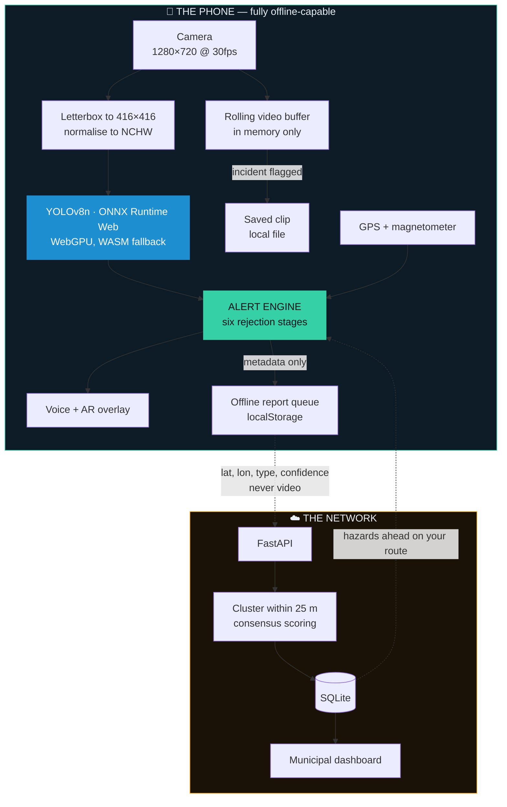
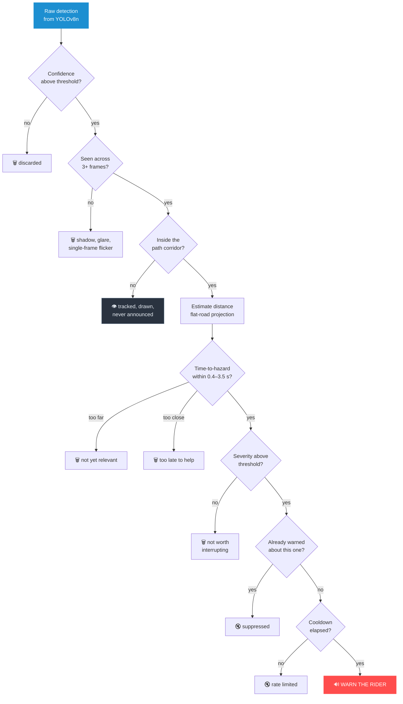
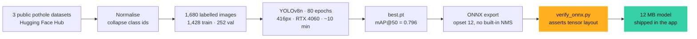
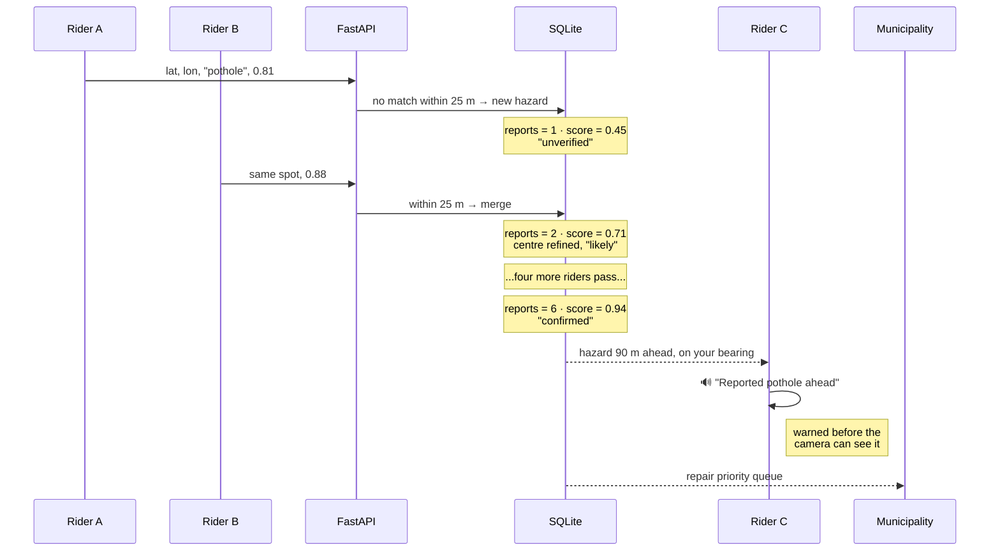
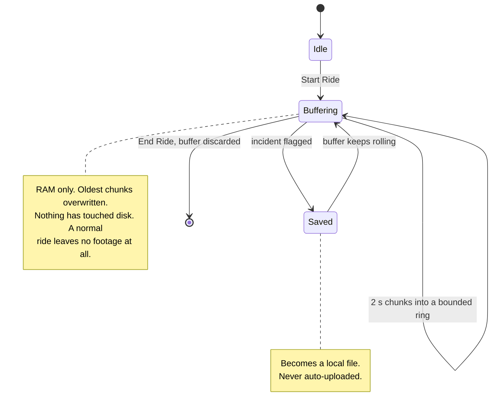
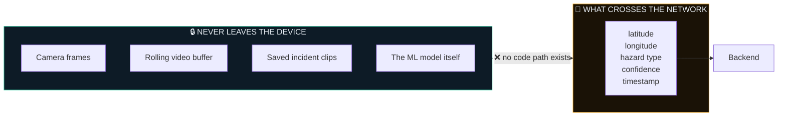
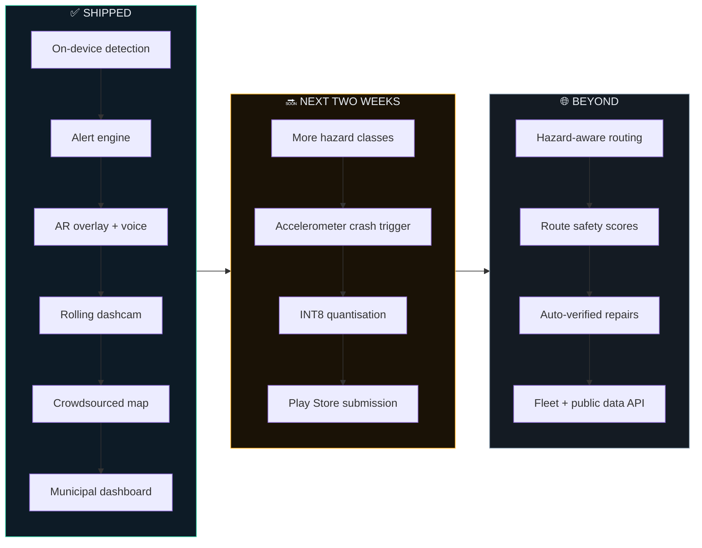

<div align="center">

# PathFinder AR

### ADAS for the 200 million two-wheelers that will never have ADAS.

**Clamp a phone to the handlebar. It watches the road, warns you about what's coming,
records the evidence, and maps the damage — all without your video ever leaving the device.**

`YOLOv8n` · `ONNX Runtime Web` · `WebGPU` · `TypeScript PWA` · `FastAPI` · `SQLite`

*Built for Build with India / Bharat 2.0*

</div>

---

## The problem, stated honestly

A car with a ₹15 lakh price tag gets lane-keep assist, collision warnings and a
dashcam. A rider on a ₹80,000 commuter bike — the vehicle that carries **over
70% of India's registered motor vehicles** — gets nothing. No crumple zone, no
airbag, no warning, and the worst road surface of any road user, because a
pothole a car absorbs is a pothole that puts a two-wheeler on the tarmac.

The failure is almost always the same, and it is a failure of **time**:

> The hazard was visible. The rider simply saw it half a second too late.

At 40 km/h you cover 11 metres a second. Spotting a water-filled pothole at 8
metres gives you roughly **0.7 seconds** — less than human reaction time plus
braking distance on a two-wheeler. The information existed. It arrived late.

PathFinder AR is built on a single premise: **the phone already on the
handlebar can see the road, and it can see it earlier than you can react.**

---

## What it actually does

<table>
<tr><td width="50%" valign="top">

**Sees the road**
On-device YOLOv8n scans the camera feed for road hazards, drawing an AR glow
over anything it finds.

**Decides whether to speak**
Six filters stand between a detection and a warning. Most detections are
deliberately, silently discarded.

**Warns in time**
Voice first — *"pothole ahead, 20 metres"* — because a rider's eyes belong on
the road. The screen only confirms.

</td><td width="50%" valign="top">

**Remembers the incident**
A rolling in-memory dashcam. Nothing hits storage until you flag it.

**Maps the damage**
Anonymous coordinates go to a shared hazard map, so the next rider is warned
before their camera can see it.

**Feeds the city**
The same data becomes a live repair-priority dashboard for a municipality.

</td></tr>
</table>

---

## Run it on a phone

Three commands. The app is built once and served by the backend, so the whole
product — rider app, API and municipal dashboard — lives on **one origin on one
port**, which is then exposed to the internet.

```bash
pip install -r server/requirements.txt
python server/seed_demo.py                            # optional: a populated demo map

cd app && npm install && npm run build && cd ..       # dist/ is what the backend serves
uvicorn server.main:app --port 8000                   # app + API + dashboard on :8000
cloudflared tunnel --url http://127.0.0.1:8000        # prints a public https URL
```

Open the printed URL on the phone, allow camera and location, tap **Start
Ride**. The dashboard is the same URL + `/dashboard`.

**The phone does not need to be on your wifi.** The tunnel dials *out* to
Cloudflare, so there is no public IP, port forwarding or router access
involved — the laptop can sit at home while the phone rides on mobile data.
HTTPS comes free with the tunnel, which matters because browsers refuse to hand
over a camera on an insecure origin.

> **Load it once on wifi before setting off.** First visit pulls ~38 MB — the
> 12 MB model and the 25 MB WASM runtime — after which the service worker has
> them cached. Then, crucially: **inference is local, so detection and the
> dashcam keep working with no signal at all.** Only the shared hazard map
> pauses, and queued reports drain when it returns.

Quick tunnels are for testing, not for a submission: the laptop must stay
awake, and the hostname is random and dies with the process. A permanent link
means deploying `app/dist` to any static host and the backend anywhere that
runs Python.

### Developing on it

`npm run dev` instead, for hot reload while editing. It serves over HTTPS with a
self-signed certificate on a LAN address, so a phone **on the same wifi** can
reach it past the certificate warning — useful for iterating on the UI, but the
build-and-tunnel route above is the one for actually riding.

Full phone and Play Store instructions: **[`android/README.md`](android/README.md)**

---

## The core insight

> **The detector is the easy 20%. Everything that makes it usable is the other 80%.**

Anyone can point YOLO at a road video. The result is unusable. It fires on
shadows, tar patches, manhole covers, wet asphalt and drain grates — dozens of
times per kilometre. A rider learns to ignore it inside one commute, and an
ignored safety system is worse than none, because it consumed attention and
returned nothing.

A useful system is defined by **what it refuses to say**. PathFinder AR's real
engineering is a rejection pipeline: six stages, each throwing work away, so
that a typical ride produces **two or three warnings that are all worth
hearing**.

That logic lives in **[`app/src/hazards.ts`](app/src/hazards.ts)** — 241 lines
of plain arithmetic with no browser dependency, covered by assertions in
[`hazards.check.ts`](app/src/hazards.check.ts).

---

## System architecture



---

## The alert engine — six stages of saying nothing

Every stage below exists to **delete** a detection. What survives all six is
worth a rider's attention.



| Stage | The question it asks | What it kills |
|---|---|---|
| **Confidence** | Is the model even sure? | Noise |
| **Temporal persistence** | Is it still there three frames later? | Shadows, glare, wet patches, flicker |
| **Path relevance** | Is it in the lane I'm riding into? | Kerb-side and oncoming-lane hazards |
| **Proximity** | How far away, in metres? | *(computes, doesn't filter)* |
| **Time-to-hazard** | Do I still have time to act? | Both the too-early and the too-late |
| **Severity** | Is this worth interrupting for? | Minor blemishes on bad roads |
| **Suppression** | Have I already said this? | Repetition, alert fatigue |

> **The stage judges tend to ask about is #3.** A pothole at the kerb gets
> detected, tracked and drawn on screen — and the system stays deliberately
> silent, because it isn't in your path. Silence is a designed output, not an
> absence of one. It's the most convincing thing to demo live.

---

## Distance from a single camera, without a depth sensor

A phone has no LiDAR, no stereo pair, no radar. It doesn't need them, because
roads are approximately flat, and that constraint alone is enough.

If the road is a plane and the camera sits at a known height, then **where the
bottom of a bounding box falls in the frame** determines its distance. An object
touching the horizon is infinitely far; one at the bottom edge is right under
your wheel.

```
        camera
          │╲
   height │  ╲   θ = angle below the horizon
     (h)  │    ╲
          │      ╲
   ═══════╧════════╲═══════════════════ road plane
          |◄──── d ────►|

                    h
             d = ───────
                  tan θ

   θ is read straight off the frame: how far below the
   horizon line the bottom of the box sits.
```

Combined with GPS speed this yields **time-to-hazard**, which is what the
warning decision actually turns on — 30 metres is urgent at 60 km/h and
irrelevant while walking the bike.

### It ships with a calibration knob, on purpose

The formula is only as honest as the geometry you give it. A phone clamped to a
scooter sits at a different height and rake than one on a sports bike, and
`d` is **directly proportional to camera height** — get it wrong and every
warning arrives at the wrong moment.

So mount height, horizon position and field of view are **sliders in the app**,
not constants in the source:

| Setting | Default | Why it's exposed |
|---|---|---|
| Camera height | 1.00 m | Scooter vs. sports bike differ by 40 cm+ |
| Horizon position | 0.45 | Depends entirely on mount angle |
| Vertical FOV | 55° | Varies by handset and lens |
| Warn-ahead time | 3.5 s | Rider preference and typical speed |

Setting them takes about a minute, once, with the phone in its mount:

1. **Camera height** — measure lens to road with a tape. Distance scales
   linearly with this, so it is the one worth measuring rather than guessing.
2. **Horizon position** — look at the camera view and drag until the green
   corridor lines sit on your lane edges. Those lines are drawn from the same
   function the engine tests against, so what you see is exactly what will be
   treated as "in my path".

*Clean models don't survive contact with physical hardware. Leaving the knob is
the engineering, not a shortcut around it.*

---

## The machine learning pipeline



```bash
python ml/prepare_data.py    # fetch, merge, normalise, split
python ml/train.py           # train + export to app/public/models/
python ml/verify_onnx.py     # assert the export matches what the app decodes
```

### Results — best checkpoint, epoch 79

| Metric | Value | Reading |
|---|---|---|
| **mAP@50** | **0.796** | Finds the great majority of visible potholes |
| **mAP@50-95** | **0.470** | Boxes are approximately right — fine, since we only need the *bottom edge* |
| **Precision** | **0.828** | ~1 in 6 raw detections is a false positive |
| **Recall** | **0.733** | Misses roughly a quarter |
| **Size** | **12 MB** | Ships inside the app; loads offline |
| **On-device** | **~5 fps** | Measured, mid-range Android, WebGPU |

**Read those numbers honestly.** A precision of 0.83 means a false positive
several times a minute. On its own that is an unusable product — which is
precisely why the alert engine exists, and why we describe it as the core of
the system rather than a wrapper around it. The temporal-persistence filter
alone removes most false positives, because a shadow doesn't survive three
frames of a moving camera the way a real pothole does.

Training augments for what actually degrades road detection from a bike — dim
light, motion blur, scale variation — and never flips vertically, because roads
don't appear upside down.

> **Why not a bigger model?** A YOLOv8s would score higher and run at ~2 fps on
> the same phone. At 40 km/h, 2 fps means 5.5 metres between frames. Latency
> *is* accuracy in a moving-vehicle system.

---

## The crowdsourced hazard network

One rider's detection is a rumour. Six independent riders detecting the same
thing at the same coordinates is a fact. The backend turns the first into the
second.



### The consensus score

```
score = min(1, mean_confidence × (1 − 0.55^reports) × 1.25) × 0.5^(age / 45 days)
```

Three deliberate properties:

- **Corroboration saturates fast.** The gap between 1 and 6 reports matters
  enormously; between 6 and 60 it doesn't. Riders don't need three decimal
  places of certainty.
- **Markers decay.** A 45-day half-life means a repaired road stops generating
  warnings without anyone filing a report saying so. Absence of new sightings
  *is* the signal.
- **Confidence is inherited, not asserted.** The detector's own uncertainty
  propagates into the map, so a hesitant detection can never produce a
  confident marker.

Riders are warned about network hazards only when the hazard lies **within 40°
of their heading** — so you're told about the pothole around the blind corner
you're approaching, never the one behind you.

---

## Rolling dashcam / digital black box



A dedicated motorcycle dashcam costs ₹8,000–15,000 and gets stolen off the bike.
This is the phone you already own, and the footage only becomes a file when
*you* say an incident happened — which is simultaneously the storage story and
the privacy story.

---

## Privacy, enforced by architecture

Privacy claims are only credible if the code makes the violation *impossible*
rather than merely *disallowed*. **There is no upload path for video anywhere in
this repository.**



- Frames are analysed in volatile memory and discarded.
- The payload carries **no account, no device id, no session id** — see
  [`server/main.py`](server/main.py). Reports are unlinkable to each other.
- Sharing can be switched off entirely in Settings; **the safety loop is
  unaffected**, because it never needed the network.
- Inference is local, so the system works identically in a tunnel, a dead zone,
  or with mobile data off.

---

## Technology choices, and the reasoning

| Layer | Choice | Why this and not the obvious alternative |
|---|---|---|
| **App shell** | TypeScript PWA, no framework | Web gives camera, GPS, magnetometer, speech, `MediaRecorder` and GPU compute. Ships to a phone from a URL. React/Flutter would have spent the deadline on toolchain, not product. |
| **Inference** | ONNX Runtime Web, WebGPU → WASM | WebGPU is several times faster on modern Android; WASM guarantees it runs anywhere. Same model binary for both. |
| **Model** | YOLOv8n @ 416px | Latency *is* accuracy on a moving vehicle. See the note above. |
| **Maps** | Leaflet + OpenStreetMap | Zero API keys, zero billing, no vendor signup between a judge and a working demo. |
| **Routing** | Nominatim + OSRM | Same reasoning. Public demo endpoints — fine for a prototype, explicitly not production. |
| **Backend** | FastAPI + SQLite | One file, one process, no migrations. Spatial queries are a bounding box plus haversine, which is correct at city scale. |
| **Distribution** | PWA → Trusted Web Activity | A real signed `.aab` Google Play accepts, with full camera and GPS access. |

### Why a PWA is a strength, not a compromise

The single most common objection is *"shouldn't this be native?"* The honest
answer:

1. **Everything the safety loop needs, the web provides** — and it's all in use
   here, including GPU-accelerated neural inference and the magnetometer.
2. **It installs from a URL**, which is worth an enormous amount during judging.
3. **The Play Store path is real**, not hypothetical — Trusted Web Activity is
   Google's own mechanism, and Bubblewrap is Google's own tool.
4. **Nothing is throwaway if we do port.** The alert engine is dependency-free
   arithmetic that moves to Dart in an afternoon, and `ml/train.py` exports
   TFLite by changing one word.

The one thing the web genuinely cannot do is record with the screen off. If that
becomes a requirement, that — and only that — is the trigger to go native.

---

## Repository map

```
pathfinder-ar/
├── ml/                        The model
│   ├── prepare_data.py        Fetch + merge 3 datasets → unified YOLO format
│   ├── train.py               Fine-tune YOLOv8n, export ONNX to the app
│   └── verify_onnx.py         Assert the export matches the app's decoder
│
├── app/                       The rider app
│   ├── src/detector.ts        ONNX session, letterboxing, YOLO decode, NMS
│   ├── src/hazards.ts     ★   THE ALERT ENGINE — tracking, geometry, severity
│   ├── src/hazards.check.ts   Runnable assertions for the above
│   ├── src/geo.ts             GPS, compass, offline queue, hazard network
│   ├── src/nav.ts             Geocoding + routing
│   ├── src/dashcam.ts         Rolling in-memory buffer
│   ├── src/alerts.ts          Chime + speech synthesis
│   └── src/main.ts            Orchestration, AR rendering, UI
│
├── server/                    The network
│   ├── main.py                Clustering, consensus scoring, API
│   ├── dashboard.html         Municipal repair-priority dashboard
│   ├── seed_demo.py           Realistic demo data
│   └── test_server.py         Runnable assertions
│
├── android/README.md          Phone testing → Play Store, step by step
└── docs/DEMO.md               Shot list for the demo video
```

---

## Verification

No test framework, no fixtures — just the assertions that must never silently
break, runnable in one command each.

```bash
cd app && npm run check      # alert engine: persistence, path, severity, suppression
python server/test_server.py # clustering radius, consensus scoring, decay, filters
python ml/verify_onnx.py     # ONNX tensor layout matches the TypeScript decoder
```

That last one earns its place: if an export ever changes the head layout, the
app would silently draw boxes in the wrong places — a bug you'd discover on a
bike rather than at a desk.

---

## Limitations — the honest list

We would rather state these than have them found.

| Limitation | Detail | Path forward |
|---|---|---|
| **One hazard class** | Potholes only. Speed breakers, water-filled potholes and waterlogging are in the severity model but have no training data yet. | Annotated Indian data. **Zero code changes** — the pipeline is class-agnostic. |
| **Flat-road assumption** | Distance is optimistic on inclines and crests. | Fuse the accelerometer for pitch. |
| **~5 fps on mid-range hardware** | ~2 metres of travel between frames at 40 km/h. | INT8 quantisation; NNAPI/CoreML if we go native. |
| **Precision 0.83** | A false positive several times a minute at the detector. | The alert engine already suppresses most; more data raises the floor. |
| **Manual incident trigger** | Button or double-tap. The accelerometer crash trigger isn't wired. | Straightforward — the sensor API is already open for the compass. |
| **No auth, no rate limiting** | The report endpoint trusts its callers. | Correct for a prototype, unacceptable in production. Needs attestation before real scale. |
| **Public routing endpoints** | Nominatim and OSRM demo servers are rate-limited. | Self-host, or swap in a commercial key. |
| **Battery and thermals** | Continuous camera + inference is demanding, worse in Indian summer heat. | Duty-cycle inference by speed; drop fps when stationary. |
| **Not on the Play Store yet** | A new developer account takes days to clear review. | The TWA build path is documented and ready. |

---

## Roadmap



---

## Why the data matters beyond the app

The consumer app creates value for the rider. The dataset it generates creates
value for everyone else — and they're deliberately separable businesses.

- **Municipalities** replace manual road surveys with a live, confidence-ranked
  repair queue. The dashboard in this repo is that product in miniature.
- **Fleet operators** route delivery riders around damage, cutting both vehicle
  maintenance and workplace injury.
- **Insurers** get empirical road-risk data for pricing, and riders get dashcam
  footage for claims.

The rider never pays. The rider is the sensor, and gets safety in exchange.

---

<div align="center">

**Every rider has hit a pothole they saw half a second too late.**

*That half second is the entire product.*

</div>
